==**面试部分**==：

**消息推送平台承接着站内对各种类型渠道的消息下发，每天承载亿级流量推送。项目主要对用户侧的召回（营销）以及通知消息触达，也同时负责对内网的告警和通知消息发送**。

在真正面试的过程中，当面试官让你项目介绍的时候，你就可以这样答：

**1**、消息推送平台它承接着各种消息类型的推送，比如短信、邮件、小程序、微信公众号、通知栏PUSH、企业微信、钉钉等等。你可以简单理解为：只要发送消息的，就跟它脱不了关系。

**2**、发送的消息主要给两部分用户，一部分是我们站内的真实用户（比如我们给用户发短信验证码），另一部分是我们内网的消息（比如钉钉的工作提醒、群消息助手）

如果这时候面试官不打断你，你就继续跟面试官说：**要不我来给你讲下系统的架构？**

如果面试官打断了，问了别的问题，那在这就先结束了，不过，你总会**遇到机会**把你的项目架构跟面试官描述描述。

这个过程中，你可以拿上你的笔和纸给面试官**画画**，交流交流，其实就是我GitHub仓库中`README`的这个图：

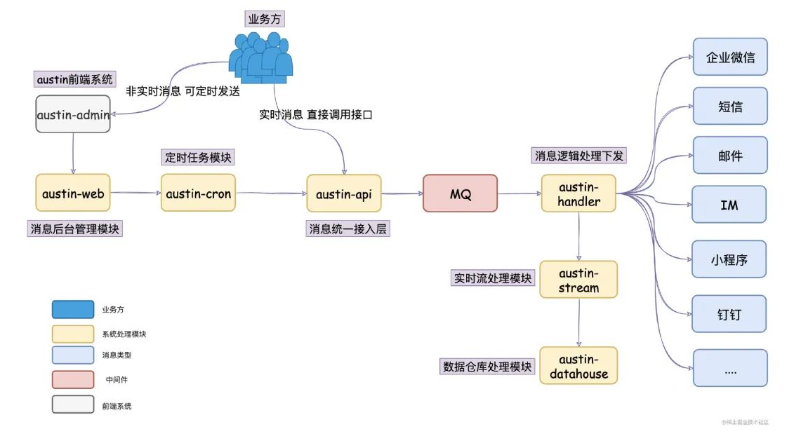

这个过程可以这样跟面试官描述：

**1**、在消息推送平台里，我们有个接入层`austin-api`，它是**消息的统一入口**，所有的消息推送都会经过该接入层进行处理。

**2**、使用消息推送平台的业务方可以简单分为两种角色：运营和技术。如果是技术，他会调用我在接入层暴露的接口。如果是运营，他会使用我的消息推送后台去设置定时任务推送，所以我们会有个推送后台`austin-admin`以及定时任务模块`austin-cron`

**3**、接入层干的事情比较简单，简单概括就是消息做简单的校验以及参数拼装后就写入到了消息队列

**4**、写到了消息队列之后，自然就有个逻辑层对消息队列的消息进行消费，在我这边叫做`austin-handler`模块，它主要对消息做去重、夜间屏蔽等逻辑，最后就分到不同的消息类型Handler进行消息发送

**5**、消息推送平台跟普通消息下发最大的不同是我们是实现对**消息全链路追踪**的，业务方可以通过推送后台实时查看消息下发的情况，针对消息模板和用户都是OK的（比如这个用户是否接收到消息，如果没接收到，那可能是因为什么被过滤了）

**6**、所以消息推送平台会有个实时流的模块，用Flink实现的。我在消息处理的过程中**对多个关键的位置进行埋点**，在Flink对这些信息做清洗处理，实时的会写进Redis、离线的会落到Hive中

基于这个描述，以及你画的图，面试官一般就能有个比较简单的认知了，至少这个过程中你证明了你这系统是有设计的。有可能听到一半就会被打断问细节的，也可能会听你说完全程，**但至少你要有类似这种描述**。

不要上来就讲各种的实现细节，各种如何实现去重、夜间屏蔽的功能。**面试官如果感兴趣，他肯定会在后面问你的**，在这里先把系统的整体架构跟他聊一遍。

## 02、项目角色

**项目主要负责人**

不要慌，别说自己负责数据库表的设计这种，**如果你是新人，数据库表还轮不到你设计**。`austin`有完整的从零搭建文档，只要你用心研究了，就应该写项目负责人。

如果你只看了几天，并且你认为你几天就能完全搞懂，那我还是劝你不要把austin写在你的项目上。

## 03、项目技术栈

**SpringBoot、Flink、Redis、Apollo等**

这里把自己熟悉的技术栈拎出来讲讲，不熟悉的就隐藏起来（比如`Spring Data JPA`，你就用过，只知道它的底层实现是Hibernate，那就不要在这里了）。但如果你对`Mybatis`又很了解，你就可以把`Mybatis`加上（反正面试官又看不到代码，你说`Mybatis` 那就是`Mybatis` ，OK？）

注意的是：这里写的技术栈，自己是要**有点墨水**的（很容易就被问到），为什么使用XXX而不使用XXX啊？当时是怎么考量的。

## 04、系统设计亮点

**1**、全类型渠道消息的生命周期链路追踪：在每个关键处理的阶段上进行埋点，将点位收集到Kafka，Flink统一清洗处理。实时数据写入Redis，离线数据写入Hive，固化出实时和离线的统一推送基础模型

**2**、消息资源隔离：不同的渠道不同的消息类型互不影响并且利用动态线程池可配置化地对消费能力进行调控

**3**、拥有完备的消息管理平台基础建设：对系统和应用资源有完整的监控和告警体系、消息模板工单审核、各种消息模板的素材管理等等

作为一个平台，我理解下应该关注的是着**可用性**、**可扩展性**以及**平台能力**。

这里写出的项目亮点可能**后续还会增改**，但这以上几点我感觉都是可以拉出来跟面试官聊聊这其中的实现过程的（特别是第一点和第二点）

在简历上我建议不要写太多技术上的细节，这个系统核心功能简单可能面试官能get到，但如果是业务系统，面试官就不知道你在写什么了。如果面试官感兴趣，是会问你技术细节的，到时候再好好吹就行啦。

## 05、总结

**项目描述**：消息推送平台承接着站内对各种类型渠道的消息下发，每天承载亿级流量推送。项目主要对用户侧的召回（营销）以及通知消息触达，也同时负责对内网的告警和通知消息发送。

**项目角色**：项目主要负责人

**项目技术栈**：SpringBoot、Flink、Redis、Apollo等

**系统设计亮点**：

- 全类型渠道消息的生命周期链路追踪：在每个关键处理的阶段上进行埋点，将点位收集到Kafka，Flink统一清洗处理。实时数据写入Redis，离线数据写入Hive，固化出实时和离线的统一推送基础模型
- 消息资源隔离：不同的渠道不同的消息类型互不影响并且利用动态线程池可配置化地对消费能力进行调控
- 拥有完备的消息管理平台基础建设：对系统和应用资源有完整的监控和告警体系、消息模板工单审核、各种消息模板的素材管理、规则引擎快速接入短信渠道消息等等功能

后面austin更多的面试细节，我会陆续继续补充，欢迎点个**star**持续关注我的项目，不会让你失望的

项目设计模式

###### 01、责任链模式

我在「消息统一接入层」那里使用了**责任链模式**，用责任链模式的好处就是**分工明确、解耦、易维护**。

**1**、将多个条件判定分散到各个的处理类上，相对于`if else`耦合性相对较低。

**2**、增加一个具体的`Handler`处理类，不会影响到`BaseHandler`的代码

责任链模式的缺点：

**1**、项目里边会有多个具体Handler类（因为每种处理都抽象为一个类，所以会有多个类）

**2**、初看代码时不太好阅读（对外只是一个`doChain`方法，而里边由多个处理类来组成，还得看相应的调用顺序）
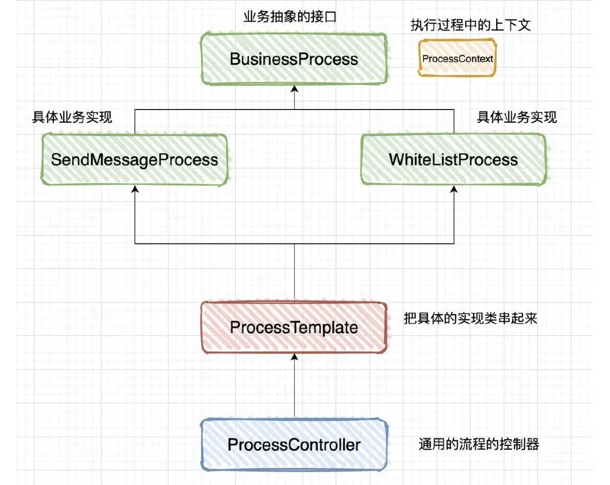

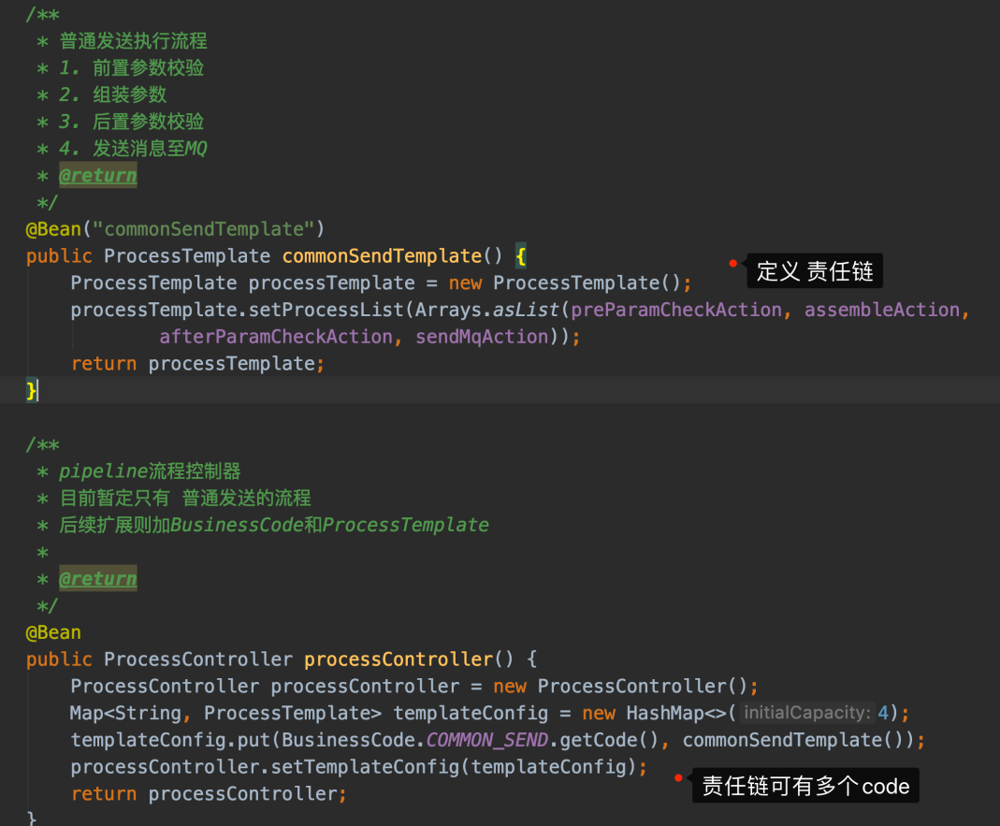
责任链**配置**入口：`com.java3y.austin.service.api.impl.config.PipelineConfig`

责任链**处理**入口：`com.java3y.austin.service.api.impl.service.SendServiceImpl#send`

###### 02、模板方法模式

在austin项目代码上用到模板方法的地方还是蛮多的，比较有代表性的就是**去重**的功能。老读者可能都知道，我认为去重的功能的核心无非是**唯一Key+存储**

模板方法模式要点：

1、把公共的代码抽取出来，如果该功能是不确定的，那我们将其修饰成抽象方法。

2、将几个固定步骤的功能封装到一个方法中，对外暴露这个方法，就可以非常方便调用了。

模板方法模式优点：**封装不变的部分，扩展可变的部分**。把认为是不变的部分的算法封装到父类，可变部分的交由子类来实现。

模板方法模式缺点：抽象类定义了部分抽象方法，这些抽象的方法由子类来实现，子类执行的结果影响了父类的结果(**子类对父类产生了影响**)，会带来阅读代码的难度！

我们在实际写代码的时候，一般存储和和步骤都已经确认下来了，唯一Key则可以由子类实现

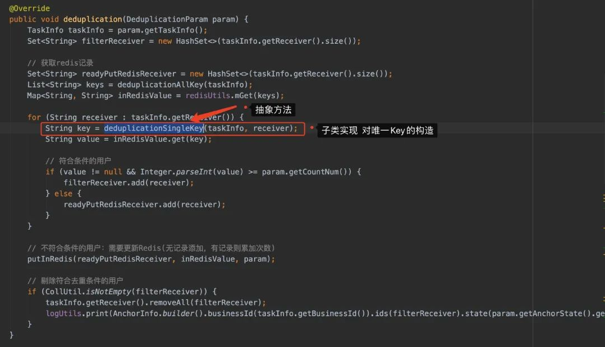
模板方法模式的代码1：`com.java3y.austin.handler.deduplication.service.AbstractDeduplicationService#deduplication`

模板方法模式的代码2：`com.java3y.austin.handler.handler.BaseHandler#doHandler`

###### 03、构建者模式

建造者模式更多的是**写法上**的不同，从代码结构层面上其实没有很大的区别，只是看起来会更清爽一些。我借助了**Lombok**，在类上加上一个注解`@Builder`就可以使用建造者模式的代码了，非常方便
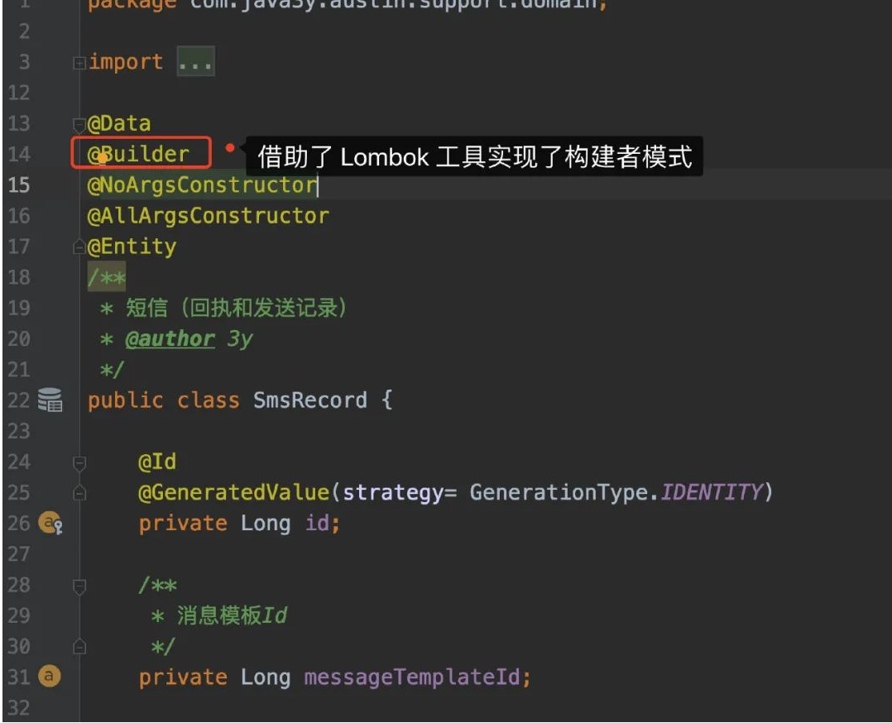

在austin里就随处可见了，各种builder**链式调用**。

###### 04、策略模式

严格意义上的策略模式是基本没什么人用的（策略模式有一个**Context上下文对象**），但如果我们说JDK线程池的设计也是**策略模式**
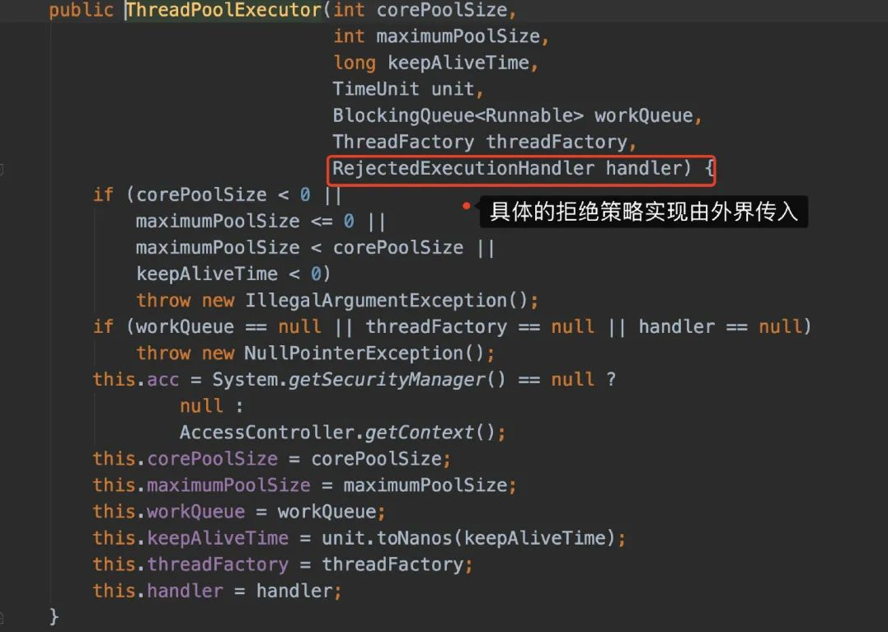

那我可以认为的是：只要我们是面向接口编程的，那多多少少都有「策略模式」的影子

所以，austin项目使用了策略模式还是有不少的

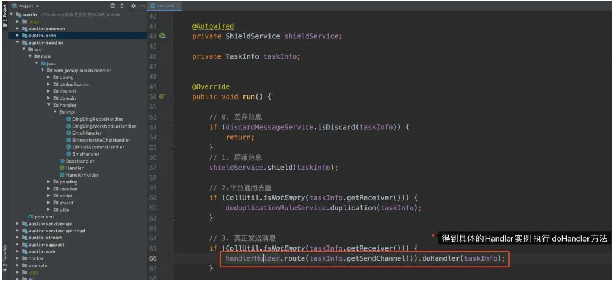
策略模式代码入口：`com.java3y.austin.handler.pending.Task#run`

###### 05、生产者消费者模式

生产者消费者模式这种「设计模式」我还看到过在面试上让手写的，像JDK线程池的实现我认为就是典型的生产者和消费者模式（将消息丢入工作队列，然后从工作队列里消费）。

我在实现延迟消费做批量的时候也实现了生产者和消费者模式，场景主要就是**我读取文件的每一行记录，积攒到一定的程度才进行消费**。

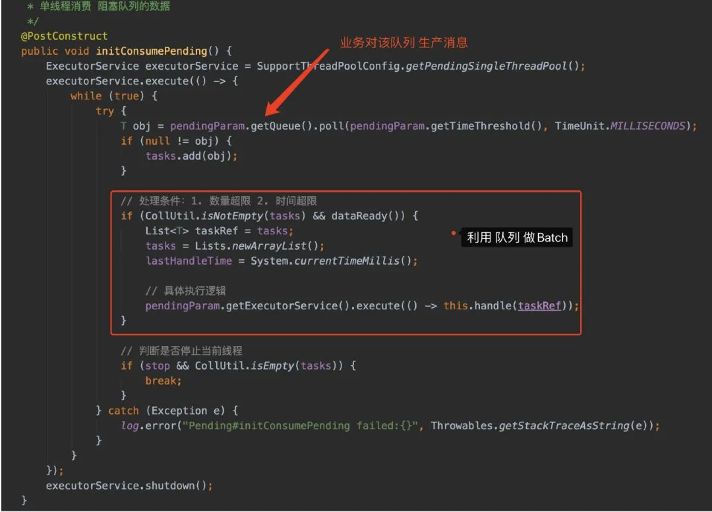
生产者入口：`com.java3y.austin.cron.service.impl.TaskHandlerImpl#handle`

消费者入口：`com.java3y.austin.support.pending.AbstractLazyPending#initConsumePending`

###### 06、单例模式

单例模式和代理模式几乎都是依赖Spring环境下去玩的了，基本都不用手写。

在Spring下普通创建的对象**默认**都是单例模式，在项目里也有部分的对象是需要多例的。

比如`com.java3y.austin.handler.receiver.Receiver`（不同的渠道不同的类型开不同的消费者组）和`com.java3y.austin.cron.pending.CrowdBatchTaskPending`（数据需各自维护，线程安全问题）

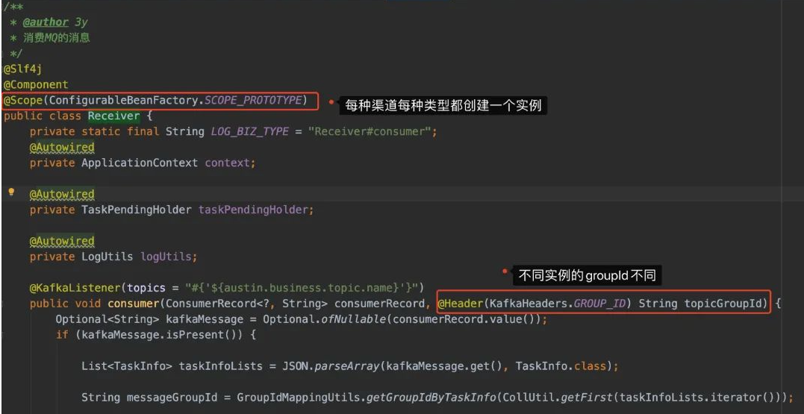
###### 07、代理模式

代理模式在austin下倒是没自己写过，用的小组件几乎都是基于代理模式去搞的。之前提及过的**优雅打印日志注解**，只要你去看源码，就一定会发现他们用的都是Spring的动态代理去实现的。

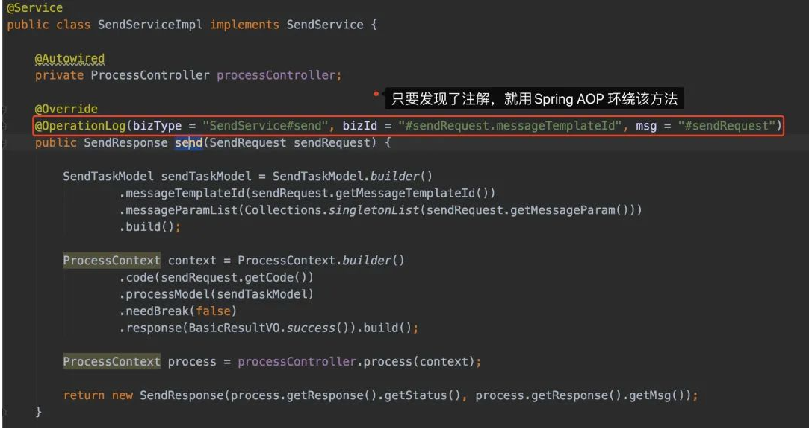
看懂了，**就说这组件是你自己优化写的**。

## 聊些指标和系统业务/架构

我们的QPS和RT的指标都来源于日志，我们在接口被调用时打印出了**耗时**（RT）以及记录了**一条日志**（QPS）。有了这日志，我们通过GrayLog就能配置出QPS和RT的监控了。所以，我们的接口对QPS和RT都是有监控的哈

在接入层部署了4台**4C8G**的机器，通过监控可以看到，日常的QPS大概百级（200左右），大促时记录的峰值是2000，RT大概在20ms。

发送接口是提供了**单发**和**批量**接口的。如果有批量推送消息的需求，我们这边是建议业务走批量接口的，这样就能一定程度上减少网络的IO，我这边所承接的QPS并不会太大。

但话又说回来，在**接口层面的压力并不大**。回到我们的系统架构上，我们有**接入层-**>**MQ**->**发送逻辑层**，接入层做的工作仅仅是组装参数，然后把消息发给MQ了。

至于压测的话，我这边没有操作过，一般是提给测试去搞的，这块我就不太清楚了。不过系统成型了以后，发送消息这种确实不太好压，**压接入层**并没有什么太大的意义（只要MQ能顶得住，那接入层就不是问题）。

发送消息的速率瓶颈一般在**下游渠道侧**，我们调用短信/邮件等渠道都会限制速度，不同的渠道还不一样。有大概几个指标：

- 腾讯云短信3000QPS（不过我们会负载到几个短信渠道方）
- 腾讯企业邮箱大概只支持百级以下QPS（当时调高了，就会限制发送失败了，没公布出具体的QPS）
- 个推PUSH我们按发送人数（8000人/QPS）进行限制
- 而IM是我们自研的（通知类的都需要进MySQL和过风控），限制人数在600人/QPS
- ...

在消费MQ的时候，我们是每个消息渠道的每种类型都会有对应的线程池进行消费，而且这个是**动态的线程池**（不用重启发布就能调整线程池的参数）
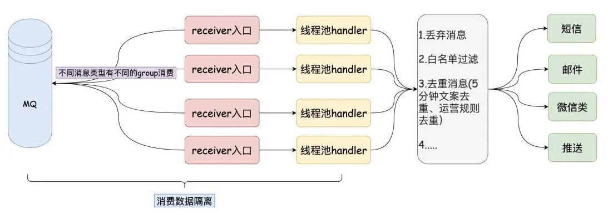

随着业务增长，当QPS真的上来了（连接数变多），我们只要**横向扩容**就好了，对于接入层来说就是无状态的。

## 总结

当我们负责一个系统时，对外需要提供接口给业务方调用，我们**是需要了解这个接口的指标以及对应的上下游**。这样在出现的问题的时候，就可以根据历史的指标去找问题，去找上下游提醒有什么风险。

面试官问到接口的性能/QPS或者压测主要是想看你**是不是真的了解你所负责的内容**，如果是搜索/推荐/流量的接口还比较好压测，但发送消息/订单/支付类似这类接口就不太好压测了。

我们能表达出对接口的指标以及相关业务的细节，那么一般面试官也不会纠着你啦（除非这个面试官也刚好做这块业务）